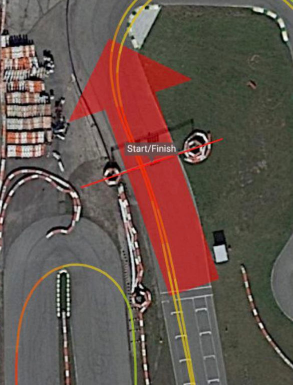
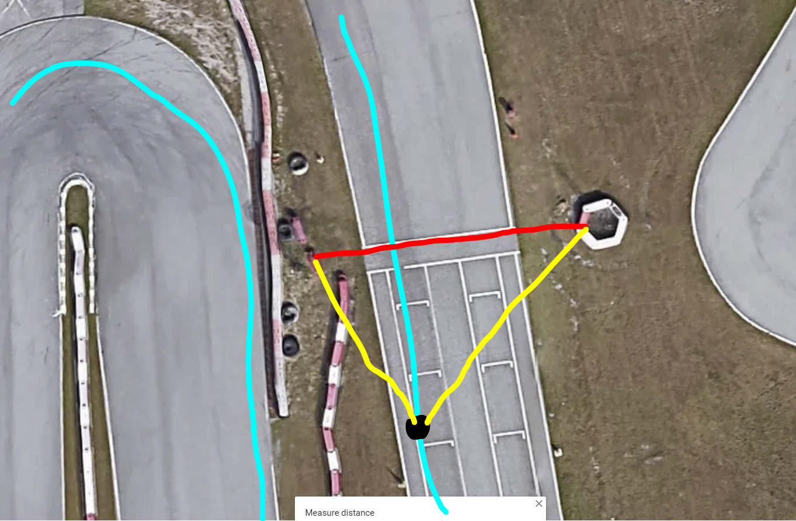
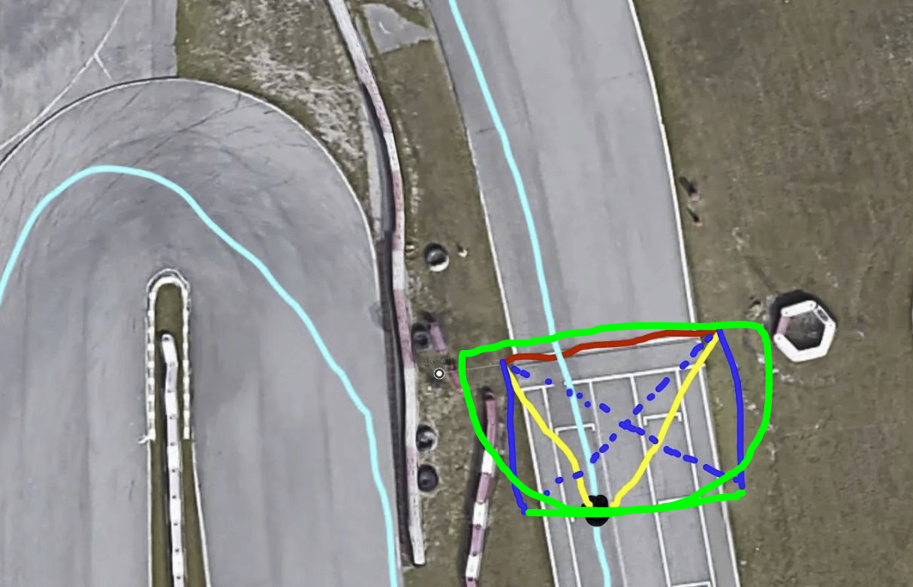
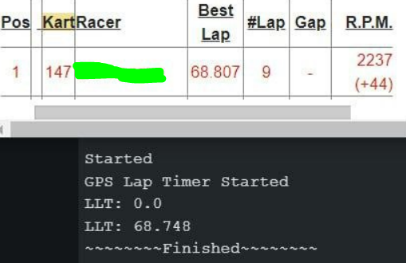

# How crossing detection works (and why it has to be weird)

This started life as a blogpost begging someone smarter than me to read it, call me an
idiot, and hand me a better solution. The funny part: nobody had to. The algorithm below
survived contact with real tracks — validated against MyLaps magnetic-loop timing and
pinned in regression tests — so this is no longer a plea for help. It's a writeup of how
crossing detection actually works, and why every "obvious" approach falls apart.

## The order of operations
Here's the quick rundown:
 1. When close enough to the crossing line, start logging GPS data-points
 2. Once we've crossed the line, stop and interpolate the exact crossing point
 3. Use that crossing point to calculate the lap time

The largest problem in this library isn't interpolating the crossing time — it's detecting
*when* we're crossing in the first place. GPS isn't real-time; it samples anywhere from
1–50Hz. So we need a detection system that reliably notices we're approaching the crossing
lines between samples.

>Oh, just check the distance from the driver to the line! Super simple.

You'd think, right? The problem shows up on more complicated tracks — and luckily my
[home track](https://www.google.com/maps/place/Orlando+Kart+Center/@28.4121941,-81.3796807,296m/data=!3m1!1e3!4m6!3m5!1s0x88e77d79e9a81b4b:0xb59d5eaa160f49b5!8m2!3d28.4109439!4d-81.3789443!16s%2Fg%2F1tgdjtv9)
is one of them. On the long configuration, turn 10 comes REALLY close to the crossing line.
There are even two painted "lines" near start/finish — I assume one is a staging line and
one is the actual magnetic loop. Configure your timer for the wrong one and the whole naive
distance check throws fits.

>What about checking the driver's heading?

Then you also have to track forward/reverse direction, AND GPS heading without a compass is
wildly inaccurate. Reading data off a much more expensive race computer, I watched the car
randomly "spin" in the recordings. Not an option.

> So add a compass?

No.

> Draw a box around the finish line?

Absolutely not. I just want crossing-lines to be two GPS coordinates.

## Let me explain... more
So here's the problem. The start/finish line below is marked properly for this track, but a
simple "distance to line" check still falls apart if you get pushed to the outside. And this
is *perfect-conditions* data.

## The first attempt (and why it broke)
This was my first wacky idea:
1. Draw the crossing line (two points), a bit wider than the track (**red**)
2. Once the driver (**black**) gets within `crossingThresholdMeters` of the line, calculate
   the type of triangle formed (**yellow**)
3. If it's an acute triangle, assume we've gotten close enough to the line
4. Start logging data points for later interpolation

The problem? Again: GPS isn't real-time. There's a specific distance from the line you have
to be at before the triangle goes too obtuse, and that window is *tiny*. In one dataset it
worked; in another it stopped working on the second lap. There's a razor-thin band where
this "works," and you can't count on landing a GPS sample inside it.

## The solution that won (currently deployed)
This is the current solution. It looks silly, but it holds up:

1. Draw the crossing line damn near identical to the width of the track (**red**)
2. Take that width and our `crossingThresholdMeters` (**blue**) and calculate the hypotenuse
   of a right triangle (**blue dotted line**)
3. Calculate the distance from the driver (**black**) to EACH crossing-line endpoint
   (**yellow**)
4. If BOTH distances are shorter than the hypotenuse, we're genuinely close to the line
5. This gives a detection-initialization area that's both *larger* and *more precise*
   (**green**)

It works with only 2 GPS data points, and it works in reverse with no changes (though your
own code may still want to note direction for logging purposes).

## Does it actually work? Yes — here's the proof
This is the part the original blogpost was waiting on. The data came in, and the algorithm
held up.

Against a real MyLaps magnetic loop at Orlando Kart Center, DovesLapTimer's interpolated
lap times track the ground-truth loop times closely — close enough to call the library "on
par with commercial solutions" without flinching:

That comparison isn't a one-off eyeball check anymore, either. It's locked into CI:

- **NMEA replay regression** — four real GPS recordings from the track are replayed through
  the timer on every push and PR. Lap times must match pinned golden values within **±10ms**,
  with a **±200ms** sanity bound against the MyLaps loop where it was recorded. Interpolation
  regressions get caught before they merge, on real noisy GPS data rather than a clean
  synthetic track.
- **Module + integration unit tests** — `GeoMath`, direction detection, course detection,
  and a full synthetic-track pass over the timing pipeline.
- **Structural** — every example compiles across AVR Mega, AVR Uno, ESP32, and the XIAO
  nRF52840.

So the hypotenuse trick isn't "a viable solution until I get more feedback" anymore — it's
the proven core of the library, with the test suite to keep it honest.

### Try it yourself with real GPS data
I built a tester so you can see the results for yourself. It stores NMEA GPS logs and
replays them with no GPS hardware required (just mind your chip's RAM limits). Two datasets
for the short track, one for the long track, and more are wired into the replay regression
suite.

[Real Track Data Debug Example Sketch (no GPS required)](examples/real_track_data_debug/real_track_data_debug.ino)
