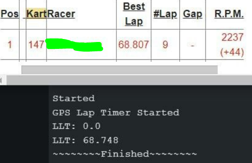

# Can a Mathematician please help
This "blogpost" was honestly created for someone smarter than me to read, call me an idiot, and provide a better solution.

## Crossing Line Detection Pains
Here's a quick rundown of the order of operations.
 1. When close enough to the crossing line, start logging GPS data-points
 2. Once we have crossed the line stop and interpolate crossing point
 3. Use crossing point to calculate lap time
 
The largest problem in this library isnt actually interpolating the crossing time, but detecting when we are crossing.
GPS isn't real-time, it operates anywhere from 1-50hz. So we need some kind of fancy detection system in place to see when we are approaching the crossing lines. 

>Oh just check the distance from the driver to the line! Super simple

You would uhhh think that right? The problem is on more complicated track, luckily my [home track](https://www.google.com/maps/place/Orlando+Kart+Center/@28.4121941,-81.3796807,296m/data=!3m1!1e3!4m6!3m5!1s0x88e77d79e9a81b4b:0xb59d5eaa160f49b5!8m2!3d28.4109439!4d-81.3789443!16s%2Fg%2F1tgdjtv9) is one of such tracks, on our long configuration, turn 10 comes REALLY close to the crossing line. Now on the track there are two "lines" painted, I assume one is a staging line, and one is the actually magnetic loop. If for some reason you configure your lap-timer for the closer painted line, this throws the entire operation out of wack.

>What about checking the drivers heading?

Then you need to also note forward/reverse directions and, AND, GPS heading without a compass is highly inaccurate, I noticed reading data off a much more expensive race computer, the car would still randomly "spin" in the recordings, this is just not an option.

> So add a compass?

No.

> Draw a box around the finish line?

Absolutely not, I just want crossing-lines to consist of two GPS cords.

### Let me explain... more
So here you can see the problem, now the start/finish line is "marked properly" for this track, but this is still throws the simple "distance to line" idea out the window if you end up getting pushed to the outside. This example data is "perfect conditions". (Ill try to gather some "bad" data next time the long track is run to better test).

### First Solution Attempted
This was my first wacky idea, what I was doing was, drawing the crossing line (two points), a bit wider than the track (**red**), then once the driver (**black**) got (`crossingThresholdMeters`) to this line, calculate the type of triangle created (**yellow**), if it is an acute triangle, we can somewhat assume we have gotten close enough to the line, start logging data points for later interpolation.

The problem? Well, again as earlier stated, GPS isn't real-time, there is a specific distance from the line you need to be, before the triangle gets too far obtuse, I noticed in one dataset it worked, and in another it stopped working on the second lap. There is a very fine line where this "works".

### Second Solution Attempted
This is my current solution, which seems much better so far with the data I currently have. This looks really silly but let me explain. First we are drawing the crossing line damn near identical with the width of the track (**red**). We then take this width, and our `crossingThresholdMeters` (**blue**) and calculate the hypotenuse for a right triangle (**blue dotted line**). Now we calculate the distance from the driver (**black**) to EACH crossing-line point (**yellow**), if BOTH lines are shorter than the hypotenuse we are actually close to the line. This allows both a "larger" yet also "more precise" detection initialization area (**green**).

This solution works with only 2 gps data points, and also works in reverse without any changes (tho your code might want to specify that for logging).
Once I get some more data from the track I can test some more, until then, this might actually be a viable solution until I can get some more feedback.

#### Example Code using real GPS data
I have actually managed to build a tester for you to see the results yourself, storing NMEA gps logs, you can replay them (just remember your chips RAM limitations). I have included 2 datasets for the short track, and 1 for the long track.

[Real Track Data Debug Example Sketch (no GPS required)](examples/real_track_data_debug/real_track_data_debug.ino)

