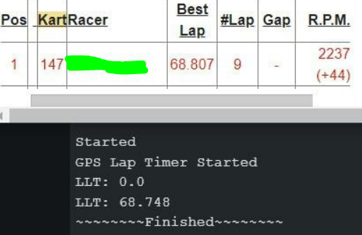

# Doves GPS Lap Timer
Library for Arduino for creating mostly accurate lap-timings using GPS data.
Once the driver is within a specified threshold of the line, it begins logging gps lat/lng/alt/speed.
Once past the threshold, using the 4 points closest to the line, creates a catmullrom spline to interpolate the exact crossing time.

## Supported Hardware: MCU
While this is technially an arduino library, this needs a device with a large amount of ram and processing power due to all the floating point math.
* Arduino Mega+
  * Technically appears to be working, really pushing it
* [Seed NRF52840 (Recommended)](https://www.amazon.com/Seeed-Studio-XIAO-nRF52840-Microcontroller/dp/B09T9VVQG7)
  * Has a dedicated high speed FPU for both floats and doubles
  * Fast enough to support GPS/Display/SDCard Logging
  * Really low power
    * 65mA~ with screen, gps, and bluetooth
  * 256KB RAM, 1MB Flash
  * Sense version **not** required
  

## Supported Hardware: GPS
  Getting GPS data is your job, not mine, but here are a couple I reccomend that work well with the Adafruit GPS library.
  
  >**Note:** The [Basic Oled Example](examples/basic_oled_example/basic_oled_example.ino) has an example on how to send ublox configuration commands while receiving only NMEA sentences.

  * [Matek SAM-M10Q](https://www.amazon.com/SAM-M10Q-Supports-Concurrent-Reception-Multirotor/dp/B0BZ7931G7/)
    * 25hz GPS only
    * 16hz GPS+GALILEO+GLONASS
    * Uses NMEA or UBLOX commands (NMEA for all included examples)
  * [Matek SAM-M8Q](https://www.amazon.com/Matek-Module-SAM-M8Q-GLONASS-Galileo/dp/B07Q2SGQQT)
    * 18hz GPS only
    * 10hz GPS+GLONASS
    * Uses NMEA or UBLOX commands (NMEA for all included examples)

  * **Check your local/regional RC plane/drone resources for a serial compatible GPS!**
    * **US:** [Race Day Quads](https://www.racedayquads.com/)
    * **EU:** [GetFPV](https://www.getfpv.com/)

## Supported Hardware: Display
  * [128x64 i2c 110X display](https://www.amazon.com/dp/B08V97FYD2)
    * **Note:** Only here for the included demo
    * **Note:** Demo also includes pre-compile switch for 1306 displays

## Supported Functions
* Current lap
  * Time
  * Distance
  * Number
* Last lap
  * Time
  * Distance
* Best lap
  * Time
  * Distance
  * Number
* Pace difference against current and best lap

### MyLaps (magnetic) Vs DovesLapTimer example



## Planned Functions
* List lap times
* Splits (when I get really bored)
  * "Optimal" Lap

Yea let me be real here, I just want the screen to flash when I have a good sector, and check my times in qualifying before the rental races.
If you want literally any other feature, use the [RaceChrono Android   | iPhone App](https://racechrono.com/) or make it yourself and submit a pull-request.

## API
See the source code, specifically the [DovesLapTimer.h](src/DovesLapTimer.h) file.
The code should have clarifying comments wherever there are any unclear bits.

#### Initialize
```c
  // Initialize with internal debugger, and or crossingThreshold (default 10)
  #define DEBUG_SERIAL Serial
  // Only change if you know what you're doing
  double crossingThresholdMeters = 7.0;
  DovesLapTimer lapTimer(crossingThresholdMeters, &DEBUG_SERIAL);
  DovesLapTimer lapTimer(crossingThresholdMeters);
  // default threshold is 7 meters, this is perfectly valid
  DovesLapTimer lapTimer;
```
#### Setup()
Currently only supports one split line, the main start/finish.
```c
  // define start/finish line
  lapTimer.setStartFinishLine(crossingPointALat, crossingPointALng, crossingPointBLat, crossingPointBLng);
  // default interpolation method
  lapTimer.forceCatmullRomInterpolation();
  // Might be more accurate if your finishline is on a location you expect constant speed
  lapTimer.forceLinearInterpolation();
  // reset all counters back to zero
  lapTimer.reset();
  
```
#### Loop()->gpsLoop()
create a simple method with the signature `unsigned long getGpsTimeInMilliseconds();` to... as it says, get the current time from the gps in milliseconds.

Now inside of your gps loop, add something like the following

All of the lap timing magic is happening inside of `checkStartFinish` consider that our "timing loop".
```c
  // update the timer loop only when we have fully fixed data
  if (gps->fix) {
    // Update current time
    lapTimer.updateCurrentTime(getGpsTimeInMilliseconds());
    // Update current posistional data
    float altitudeMeters = gps->altitude;
    float speedKnots = gps->speed;
    lapTimer.loop(gps->latitudeDegrees, gps->longitudeDegrees, altitudeMeters, speedKnots);
  }
```

Here is an example `getGpsTimeInMilliseconds()`
```c
  /**
   * @brief Returns the GPS time since midnight in milliseconds
   *
   * @return unsigned long The time since midnight in milliseconds
   */
  unsigned long getGpsTimeInMilliseconds() {
    unsigned long timeInMillis = 0;
    timeInMillis += gps->hour * 3600000ULL;   // Convert hours to milliseconds
    timeInMillis += gps->minute * 60000ULL;   // Convert minutes to milliseconds
    timeInMillis += gps->seconds * 1000ULL;   // Convert seconds to milliseconds
    timeInMillis += gps->milliseconds;        // Add the milliseconds part
    return timeInMillis;
  }
```

#### Retrieving Data
Now if you want any running information,  you have the following...
```c
  bool getRaceStarted() const; // True if the race has started, false otherwise (passed the line one time).
  bool getCrossing() const; // True if crossing the start/finish line, false otherwise.
  unsigned long getCurrentLapStartTime() const; // The current lap start time in milliseconds.
  unsigned long getCurrentLapTime() const; // The current lap time in milliseconds.
  unsigned long getLastLapTime() const; // The last lap time in milliseconds.
  unsigned long getBestLapTime() const; // The best lap time in milliseconds.
  float getPaceDifference() const; // Calculates the pace difference (in seconds...) between the current lap and the best lap.
  float getCurrentLapOdometerStart() const; // The distance traveled at the start of the current lap in meters.
  float getCurrentLapDistance() const; // The distance traveled during the current lap in meters.
  float getLastLapDistance() const; // The distance traveled during the last lap in meters.
  float getBestLapDistance() const; // The distance traveled during the best lap in meters.
  float getTotalDistanceTraveled() const; // The total distance traveled in meters.
  int getBestLapNumber() const; // The lap number of the best lap.
  int getLaps() const; // The total number of laps completed.
```
## Examples
* [WokWi Emulator (basic oled example)](https://wokwi.com/projects/367029104171726849)
  * Includes 4 laps of data
  * Custom Chip included in repo [./wokwi/](wokwi/)
    * in-browser demo does not include/support uBlox configuration commands
* [Basic Oled Example](examples/basic_oled_example/basic_oled_example.ino)
  * Shows all basic functionality, along with a simple display literally showing all basic functionality.
  * Assumes adafruit compatible [authentic ublox GPS](https://www.amazon.com/Matek-Module-SAM-M8Q-GLONASS-Galileo/dp/B07Q2SGQQT) 
    * If not authentic, commands might fail but should probably still work.
  * Originally for [Seed NRF52840](https://www.amazon.com/Seeed-Studio-XIAO-nRF52840-Microcontroller/dp/B09T9VVQG7)
    * Might need to remove/change LED_GREEN blinker
  * [128x64 i2c 110X display](https://www.amazon.com/dp/B08V97FYD2).
    * Display is NOT PRETTY, it is an EXAMPLE / DEBUG SCREEN.
    * Too tired to make serial only logger, but you can very easily remove it.
  * Borb load screen
* [Real Track Data Debug](examples/real_track_data_debug/real_track_data_debug.ino)
  * **REQUIRES A LOT OF RAM TO STORE SAMPLE DATA**
  * **Serial Only** No GPS Required
  * Simple test using data recorded at [Orlando Kart Center](https://orlandokartcenter.com/)
    * MyLaps    : 1:08:807 (magnetic/official)
    * DovesTimer: 1:08:748 (LINEAR)
    * DovesTimer: 1:08.745 (CATMULLROM)
    * RaceChrono: 1:08:630 (GPS Android App)

## License

This library is [licensed](LICENSE) under the [MIT Licence](http://en.wikipedia.org/wiki/MIT_License).

## More features?
If you want more features, go and download this dudes app RaceChrono (available on both iPhone and Android), and send the data to your phone, or log it and send it after the race.

RaceChrono is not a sponsor or affiliated, I just really enjoy the app, but don't like keeping my phone in a go-kart.
If you are looking for a "proper racing solution", you can log canbus data through the NRF52840, to the RaceChrono app. This will allow you to use a much more affordable GPS module, and have a fully fledged data logger.
You can also send this data back to another(or the same) BLE device to create custom digital gauge clusters!

Paid version required for DIY loggers and importing NMEA logs, worth every penny.

[RaceChrono Website](https://racechrono.com/) | [RaceChrono iPhone](https://apps.apple.com/us/app/racechrono-pro/id1129429340) | [RaceChrono Android](https://play.google.com/store/apps/details?id=com.racechrono.pro&pli=1)

Source code for: `can-bus logger/gps logger/digital gauges`
[https://github.com/aollin/racechrono-ble-diy-device](https://github.com/aollin/racechrono-ble-diy-device)

Pairs wonderfully with the previously mentioned [Seed NRF52840](https://www.amazon.com/Seeed-Studio-XIAO-nRF52840-Microcontroller/dp/B09T9VVQG7)


###### Might as well plug my youtube here as well  :^) bunch of 360 karting videos [https://www.youtube.com/shorts/r0rKZCIl5Zw](https://www.youtube.com/shorts/r0rKZCIl5Zw)

🤖✨ Crafted with love & a sprinkle of ChatGPT magic! ✨🤖